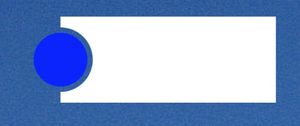
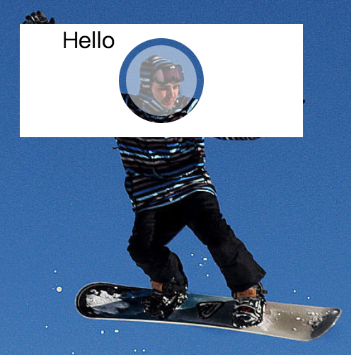

# CSS 实现镂空效果

效果一




效果二



HTML

```html
<div class="block">
  <div class="background"></div>
  <div class="thumb"></div>
</div>
```

CSS

```css
body{
  background: #000 url('http://imgsrc.baidu.com/image/c0%3Dshijue1%2C0%2C0%2C294%2C40/sign=449e772defdde711f3df4bb5cf86a46e/91ef76c6a7efce1b0cea0fe2a551f3deb58f65d1.jpg');
  background-size: 80%;
}
.block{
  width: 200px;
  height: 80px;
  margin: 50px 365px;
  position: relative;
}
.background{
  width: 100%;
  height: 100%;
  position: relative;
  overflow: hidden;
}
/* 通过 定位 确定镂空的位置 */
.background:before{
  display: block;
  content: '';
  width: 0;
  height: 0;
  background: transparent;
  border-width: 30px;
  border-style: solid;
  border-color: transparent;
  border-radius: 50%;
  position: absolute;
  top:0;
  bottom: 0;
  left: 0;
  right: 0;
  margin: auto;
  box-shadow: 0 0 0px 200px #fff;
}
.thumb{
  width: 50px;
  height: 50px;
  background: rgba(255, 255, 255, .5);
  position: absolute;
  top:0;
  bottom: 0;
  left: 0;
  right: 0;
  margin: auto;
  border-radius: 50%;
  z-index: 2;
}
```

