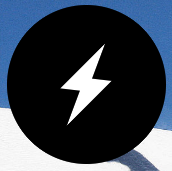

# 纯CSS实现闪电ICON



```html
<div class="lightning"></div>	
```

```css
.lightning{
  position: relative;
  width: 10rem;
  height: 10rem;
  background: black;
  border-radius: 50%;
}
.lightning:after{
  display: block;
  content: '';
  background: #fff;
  background: transparent;
  width: 0.4rem;
  height: 0;
  position: absolute;
  left: 0;
  top: 0;
  bottom:0;
  right:0;
  margin: auto;
  border-width: 0.6rem;
  border-color: #fff transparent #fff transparent;
  border-style: solid;
  -webkit-transform: rotate(170deg) skewY(-35deg) scale(2);
  transform: rotate(170deg) skewY(-35deg) scale(2);
}
```


